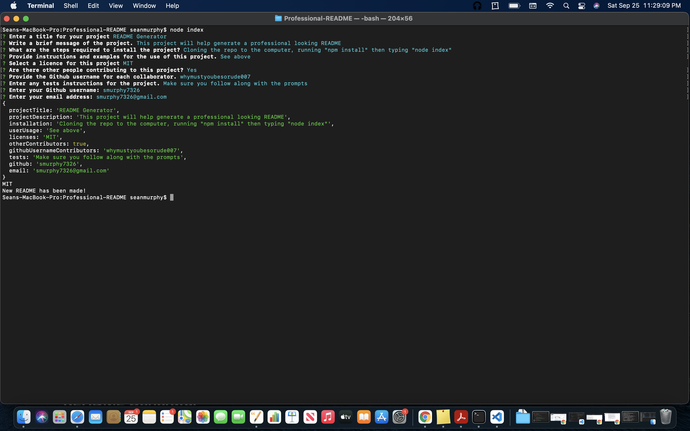
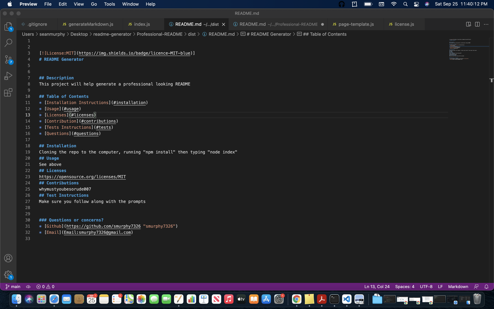
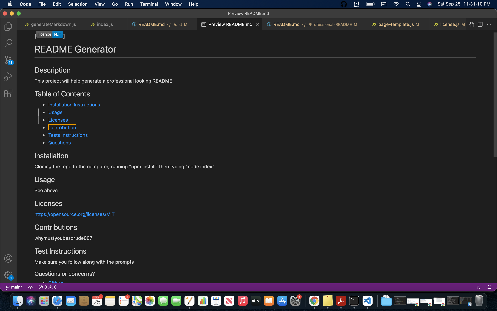

# Professional README Generator

## Description

This README.md generator uses node.js and the inquirer NPM package to ask questions and prompt the user for answers. When it has the information it takes those answers and creates a professional README. README files are able to help students and instructors alike with collaboration on projects. This application is hopefully going to help speed up the process it take to make a README, so they can focus more time on other parts of the project.

With this application feel free to look at this quick video to help get started. 

https://drive.google.com/file/d/137dtFk4SBiVyBrKcI8AlX8Z3o9k2Kx5t/view

Terminal 

VS Code terminal

VS Code Preview

## Table of Contents

* [Installation](#installation)
* [Usage](#userUsage)
* [Licenses](#licenses)
* [Contact](#contact)
* [Credits](#credits)

## Installation 

For the installation, you must have node.js installed on your computer. to download it, it can be found at (https://nodejs.org/en/download/). 

1. Click on the green code button, the SSH key and copy the link. 

2. Make sure you have a folder on your desktop that the repo can be cloned into.

3. Open Terminal or Gitbash on your computer. 

4. Move into the folder that you would like to clone to repo too.

5. When navigated into the folder type "git clone" and the link to the repo that was copied. 

## Usage 

To use this application:

1. Open Terminal or Gitbash

2. Get to the the folder that is called "readme_generator", or the first folder for this project.

3. Type in npm install to make sure you have the proper documents installed. 

4. Type in "node index" into terminal or gitbash. 

5. Answer the questions that appear in the terminal. 

6. When all of the answers are complete, the completed README will appear in the dist folder. A more in depth walkthrough can be accessed with more questions. 

## Licenses
* MIT license

## Technology
* Node.js
* Javascript

## Contact 
- [Github](https://github.com/smurphy7326)
- [Email](smurphy7326@gmail.com)

## Credits 
For the start of the project: 
- Inquirer.js: https://www.npmjs.com/package/inquirer
- Starter code: https://github.com/coding-boot-camp/potential-enigma
- UCONN Coding Bootcamp

